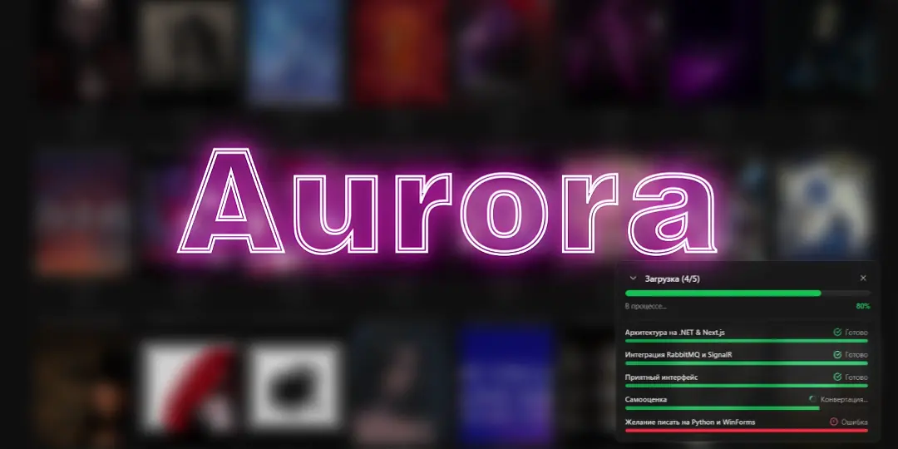
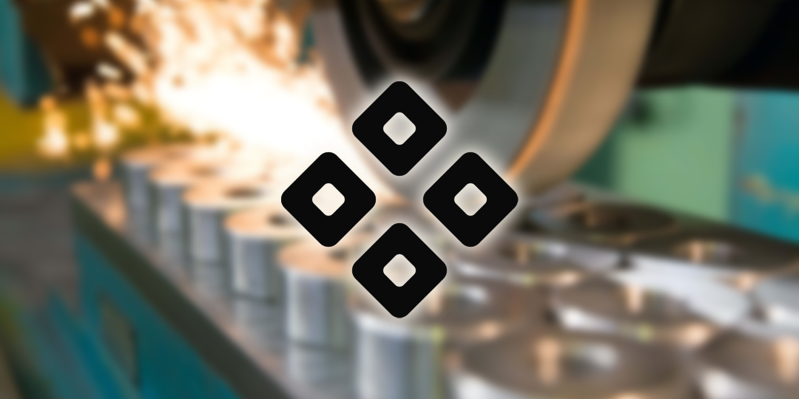
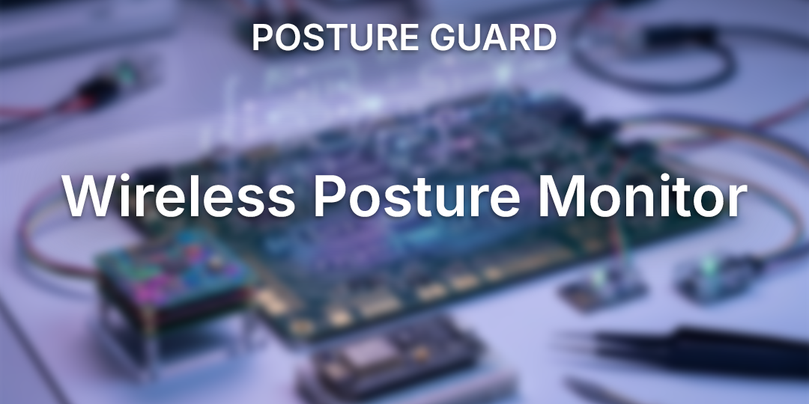

# 🛠️ Development Portfolio

> **Про цей репозиторій:** Тут зібрані мої основні проєкти, які найкраще демонструють підхід до розробки, архітектурні рішення та використані технології.

## 🧭 Навігація за каталогом

| Проєкт                            | Домен                 | Стек                             | Результат                                                                       |
| :-------------------------------- | :-------------------- | :------------------------------- | :------------------------------------------------------------------------------ |
| **[🌸 AniFlow](#aniflow)**        | Web / Highload        | .NET 8, Next.js, RabbitMQ, Redis | Повний цикл розробки та впровадження продукту                                   |
| **[🌌 Aurora](#aurora)**          | Web / Desktop / Media | .NET 8, React, FFmpeg, SignalR   | Пакетна конвертація, унікальна логіка                                           |
| **[⚙️ Grinding Calculator](#grinding)** | Engineering           | C#, .NET, WinForms               | Рутина інженерів **120 хв $\rightarrow$ 5 хв**, впроваджено в навчальний процес |
| **[🛡️ Posture Guard](#posture)**  | Hardware / IoT        | C++, ESP8266, Схемотехніка       | Від схеми до міжнародних нагород                                                |

<h2 id="aniflow">🌸 AniFlow – Агрегатор Українського Аніме Контенту</h2>

  

<!-- 181717 24292F 010409 -->

**AniFlow** – працюючий на ринку повнофункціональний сервіс для перегляду аніме українською мовою. 

Автономна платформа з багаторівневим кешуванням, автоматичною синхронізацією каталогу через партнерів, соціальними функціями, вбудованим інструментарієм для моніторингу бізнес-метрик та надійно розгорнутою хмарною інфраструктурою.

_**Стек:** C#, ASP.NET Core, EF Core, PostgreSQL, Redis, RabbitMQ, SignalR, Seq, Nginx, AWS S3, Cloudflare, CI/CD; React, TypeScript, Next.js, TailwindCSS._

<h2 id="aurora">🌌 Aurora – Desktop Комбайн для конвертації музики на вебстеку</h2>

Додаток для пакетного завантаження аудіо з YouTube, який самостійно через FFmpeg вкладає обложки, додає метаданні та зберігає готові MP3 прямо в потрібну папку на ПК. Без обмежень і з повноцінним інтерфейсом медіатеки у вигляді зручного проводника.

***Стек:** C#, ASP.NET Core, RabbitMQ, SignalR, FFmpegCore, YouTubeExplode, yt_dlp Docker; React, Next.js, TailwindCSS.*

<h2 id="grinding">⚙️ Grinding Calculator – Інженерне ПЗ автоматизації розрахунку режимів шліфування</h2>

  

> _«Скоротив час складання технологічної карти з **~120 хвилин до ~5 хвилин**.»_

Прикладне інженерне ПЗ для автоматизації високоточних розрахунків режимів шліфування матеріалів на станках. Застосунок переводить складний масив нормативно-довідкових таблиць та понад 30 наукових формул теорії різання у швидкий покроковий алгоритм. Автоматично валідує вхідні параметри, перевіряє можливість різання та генерує підсумкові карти з можливістю експорту в MS Excel.

Після розробки додаток почали застосовувати у навчальних процесах профільних дисциплін.

***Стек:** C#, .NET, WinForms.*

<h2 id="posture">🛡️ Posture Guard – IoT Система Моніторингу Осанки</h2>

  
  

**Posture Guard** – автономна IoT-система превентивного моніторингу постави в реальному часі. Передбачає статичне перенапруження хребта при тривалій роботі.

З високою точністю відстежувє кути нахилу хребта в 3-х точках за допомогою акселерометрів, передає дані по протоколу ESP-NOW та повідомляє про порушення пози через світлозвукове сповіщення.

Проєкт відзначений грамотами та офіційними сертифікатами на міжнародних науково-практичних конференціях

***Стек:** С++, Platformio; ESP8266, BMI160, TP4056.*

<h2 id="ai-map">🗺️ AI Map [WIP]</h2>

Desktop додаток, який за допомогою комп'ютерного зору визначає дистанцію та азимут до об'єктів на карті в реальному часі з функцією відстеження.

Проєкт призупинено після завершення активної розробки. Оформлення репозиторію перебуває на стадії доопрацювання.

***Стек:** Python, Ultralytics YOLOv8, OpenCV, PyQt6, MSS*

---

### 🤝 Готові зв'язатися?

  

